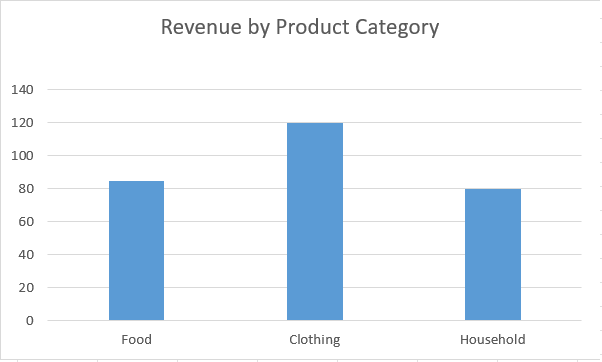

# Sales Data Analysis Project

This project demonstrates my ability to use SQL and Excel to analyse sales performance data and generate business insights.

Key skills demonstrated:
- SQL data extraction and aggregation
- Data cleaning and structuring
- Revenue analysis by product category
- Dashboard creation in Excel

# Retail Sales & Inflation Analysis (SQL Project)

## Project Overview
This project explores how inflation affects retail sales performance across provinces and product categories. Using SQL, I built a relational database and analysed sales trends, inflation-adjusted revenue, and regional demand resilience.

## Objectives
- Analyse retail revenue trends over time
- Compare nominal vs real (inflation-adjusted) sales
- Identify product categories most affected by inflation
- Evaluate which provinces show the strongest demand resilience

## Tools Used
- SQL (PostgreSQL/MySQL)
- Excel (for dashboard visualisation)
- GitHub (project documentation)

## Database Structure
The project includes four tables:
- sales_transactions
- products
- stores
- inflation_index

## Key Skills Demonstrated
- SQL joins
- Aggregations
- CTEs (Common Table Expressions)
- Window functions
- Business insight generation from raw data

## Status
Project setup in progress — database creation and analysis coming next.

## Revenue Analysis Dashboard

This chart shows how revenue is distributed across product categories.

